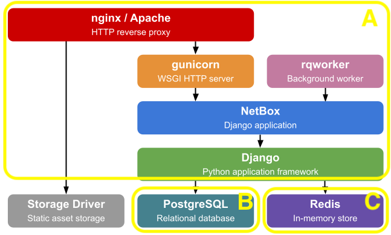
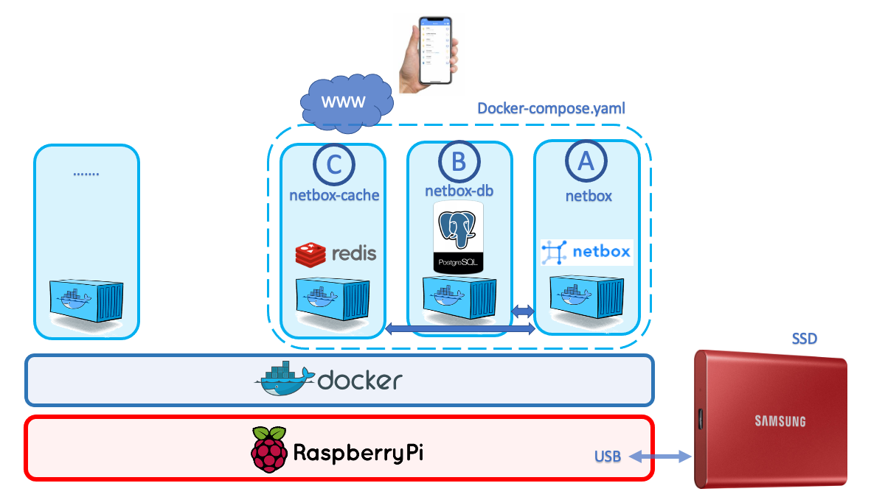
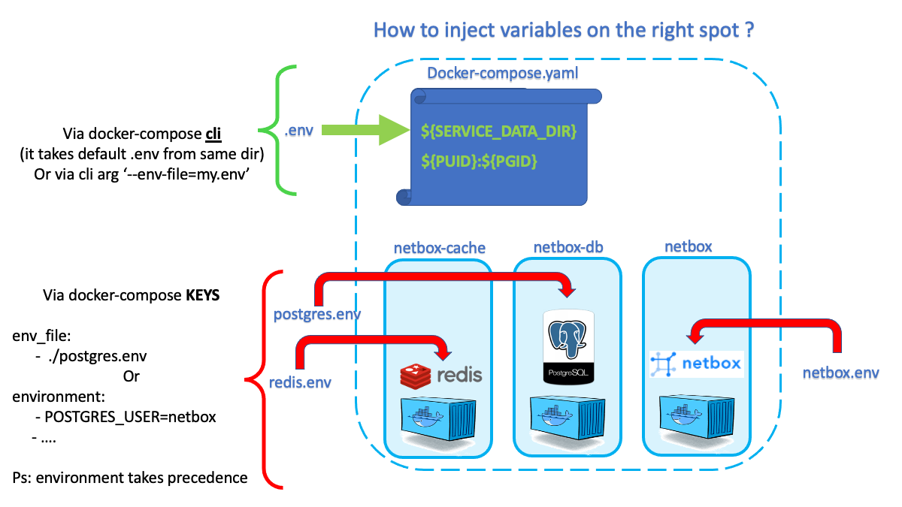

## TOC:
  0. TLDR - goto [installation](./doc/TLDR.md)
  1. What is Netbox?
  2. Architecture
  3. Netbox on RPI
  4. How to manage all your (environment) variables
  5. Installation
  6. Configuration details
  7. Troubleshooting

## 1. What is Netbox?

NetBox is a fully open-sourced platform for modern network automation and infrastructure resource management, with:

- **IPAM:** IP address management. 
    - IP addresses, networks, VRFs, and VLANs
- **DCIM:** datacenter infrastructure management
    - Equipment racks
    - Devices - Type and where they are installed
    - Connections - Network,power,..
    - Virtualization - Virtual machines and clusters
    - Data circuits - Long-haul communications circuits and providers

It has a **feature rich API** build upon a 'DJANGO framework' what makes it extremely suitable for optional automation and integration of other operational systems like monitoring, ticketing etc

| :trophy: Benefits          |
|:---------------------------|
| Single pane of glass |
| Single source of truth |


**Ref:** [see live demo on www](https://demo.netbox.dev/)

## Design Philosophy

***"Replicate the Real World"***

## 2. Architecture 


## 3. Netbox on RPI

This part describes the installation on a raspberry pi for learning, testing purposes or 'home use'.
We deploy the solution with 'docker' and 'docker-compose'. We therfore asume that you have a RPI with docker installed.

The total "Netbox solution" consist of 3 main functionalities and we will give each of them a separate docker container:

- netbox (application/nginx) -> A will be named **'netbox'**
- postgres database -> B will be named **'netbox-db'**
- redis cache server -> C will be named **'netbox-cache'**




## Basic concept



**Remark:** If would deploy this on Azure, AWS or GCP then we would only containerize A (netbox). The B (postgres) & C (redis) functionality would be privided as a PAAS service. This way the cloud PAAS service would do the 'heavy lifting' of redundancy, upgrades, security etc.

## 4. How to manage all your (environment) variables

Look carefully at the 'Docker-compose.yml' file

1) '.env' file is automatically picked up and read when executing 'docker-compose xxx'
   
   **Important:** 
   - this is for variables used in the compose file but **NOT** in the containers itself!
   - if you prefere another filename than '.env', then you will have to specify that file(eg 'my.env') when launching docker-compose: eg 'docker-compose -f my.env up
   - **Attention:** Be aware that if the same environment variable exists on the host machine (RPI) as specified in your file, the variable value of the 'host' will take precedence!
  
2) The keys 'environment:' (not used in my docker-compose.yml) and 'env_file:', specify the environment variables that will be injected **INTO THE CONTAINERS**. Example: We define 'POSTGRES_USER=netbox' in the 'postgres.env' file. If we start a shell into the running postgres container(netbox-db) we should see this environment variable

```
# first we have to geta shell into the running container
docker exec -it netbox-cache sh

# test if we see the variable
echo $POSTGRES_USER
netbox
```

**Important:** Varibles defined under the key 'environment' will take precedence over those defined in the file under 'env_file:'. Best practise is not to use both keys at the same time in order to avoid mistakes. 



## 5. Installation

[How to install on RPI](./doc/TLDR.md)

## 6. Configuration details

Here you find some extra info about Redis and Postgres and how to configure and test  both containers without launching the total netbox solution.

## 6.1 Detail configuration Redis

[Redis](./doc/REDIS.md)

## 6.2 Detail configuration Postgres

[Postgres](./doc/POSTGRES.md)

## 7. Troubleshooting

### 7.1 Starting only 1 or 2 containers of the 3

Whenever you experiencee problems, start by making sure that your redis(netbox-cache) and postgres(netbox-db) is working properly.

Start only that server from the compose file that you want to test and then perform all checks as described in 5.1 or 5.2

```
# This will only start the redis container
docker-compose up netbox-cache

# if ok then take it down again
docker-compose down

# if netbox-cache works, proceed testing postgres
# This will only start the postgres container
docker-compose up netbox-db

# if ok then take it down again
docker-compose down

```