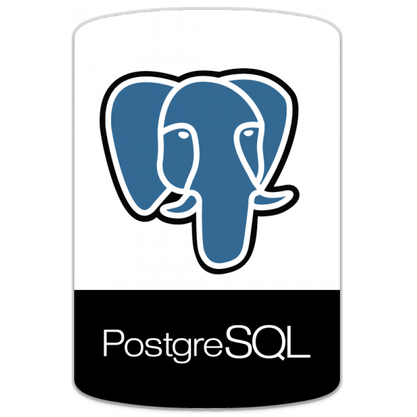
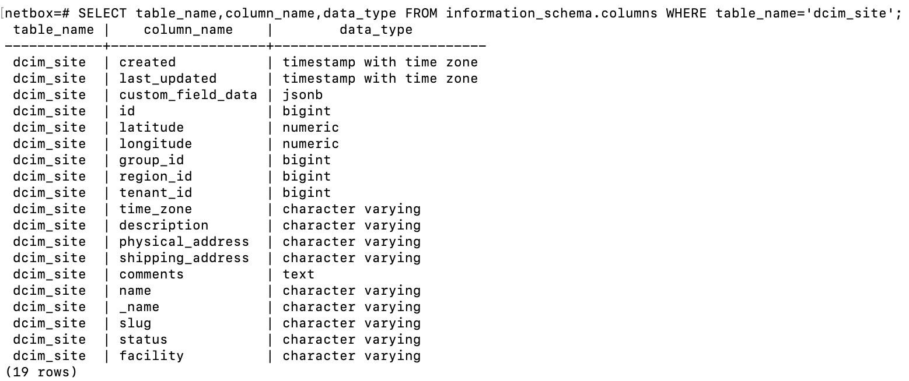
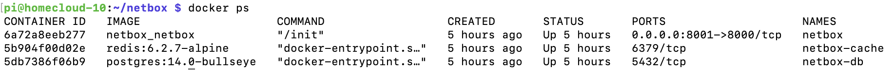
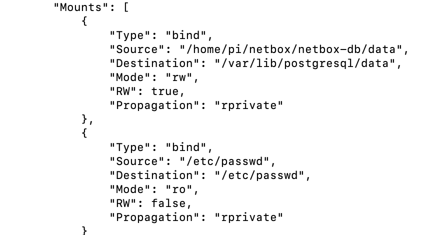
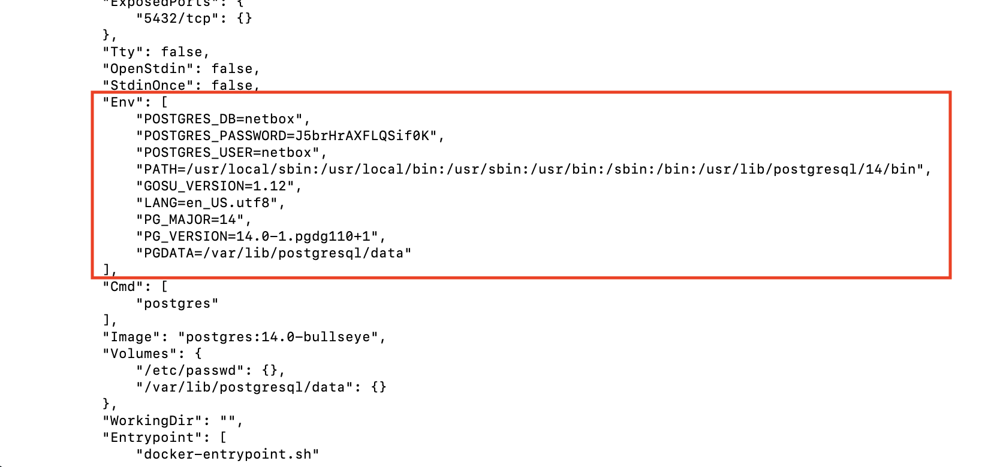

## TOC:
- 1. What is Postgres?
- 2. Usefull commands
- 3. Configuration
- 4. Postgres and Netbox
- 5. troubleshooting

## 1. What is Postgres?

Postgres is a powerful open-source object-relational SQL database.

**Why:** Postgress runs on all major operating systems, is supported by most programming languages and is ACID compliant.

**ACID:**
- **Atomicity:** In a transaction involving two or more discrete pieces of information, either all of the pieces are committed or none are.

- **Consistency** A transaction either creates a new and valid state of data, or, if any failure occurs, returns all data to its state before the transaction was started.

- **Isolation:** A transaction in process and not yet committed must remain isolated from any other transaction.

- **Durability:** Committed data is saved by the system such that, even in the event of a failure and system restart, the data is available in its correct state.

**Ref:** ISO/IEC 10026-1:1992 Section 4

## 2. Usefull commands

- psql -U <user>
- 
- 


When using a docker instance we can access the postgres host with
```
# docker exec -it HOSTNAME SHELL
docker exec -it netbox-db sh
```

Then we start psql with the user we created:
```
# psql -U <user>
$ psql -U netbox
netbox=#

# List all databases: \list or \l
netbox=# \list
```


```
# connect to database '\connect' or '\c'

# list tables in database '\dt'

``` 

```
# show table info (eg of table 'dcim_site'): columns, datatypes etc
\d dcim_site

# Query details of columns(table_name,column_name,data_type) of table (dcim_site)

SELECT table_name,column_name,data_type FROM information_schema.columns WHERE table_name='dcim_site';
```


## 3. Configuration

All configuration is done via 'postgres.env'

## 4. Postgres and netbox on RPI

**Step 1:** 'Inject the needed 'environment' variable(defined in postgres.env) into your container via the **env_file:** selector

**IMPORTANT:** Best practise is to bundle all those variables together in 1 file (postgres.env) and not mixing it with a additional 'environment:' selector in your docker-compose.yml file. This because the 'environment:' selector has precedence on the env-file and conflicts can arise.

**Step 2:** map your  host(RPI) directory **that contains your data** into a volume in the container. Hereby making sure that your databas becomes 'persistent', otherwise you loose the data if the container is killed! 

See **volumes**:
- ${SERVICE_DATA_DIR}/netbox-db/data:/var/lib/postgresql/data

ps: ${SERVICE_DATA_DIR} is an environment variable we have configured in .env and is picked up by docker-compose. If you do not succeed, first start hardcoding your path

**Step 3:** Map your host(RPI) directory that holds the user info of your host's linux os with that of the container.This with **read-only** restrictions for the container.

This makes all users from your host available in the container. An **important**requirement for postgres because the 'owner' of '/var/lib/postgresql/data' MUST be the same as the UID of user in the container (for initdb)

```
  volumes:
    - /etc/passwd:/etc/passwd:ro
```

**Ref:** See also [Arbitrary --user Notes](https://hub.docker.com/_/postgres) on dockerhub!

**'redis-server /path_in_container/redis.conf'**

### Important part of the docker-compose file for postgres
```
#... see this part of postgres in docker-compose.yml
    
    env_file:
      - ./postgres.env
    
    networks:
      - netbox
    volumes:
      - ${SERVICE_DATA_DIR}/netbox-db/data:/var/lib/postgresql/data
      - /etc/passwd:/etc/passwd:ro
```

## 5. Troubleshooting

In case of doubt:

### 5.1 Make sure that your container is running
```
List all your container - they should be 
docker ps -a
```


### 5.2 Check that your volume host(RPI)<->container were mapped correctly.

```
docker inspect netbox-db
```


### 5.3 Check that your container imported all needed environment variables




If you end up here, you are a devops star!