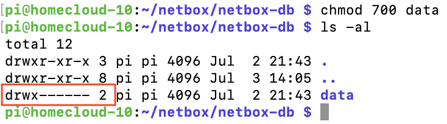
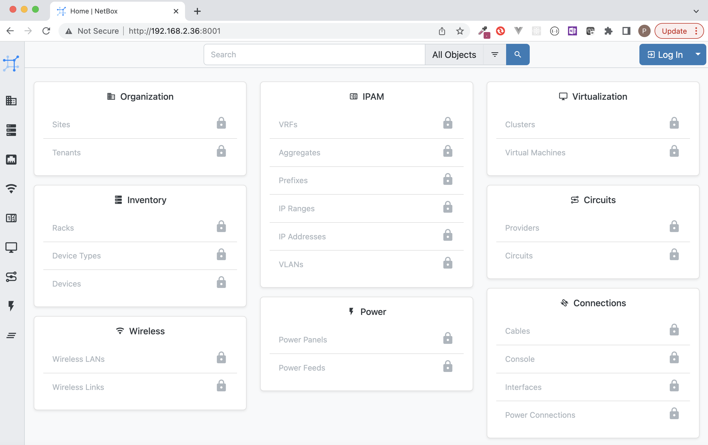

# Just Install it

## Step 1: Download directory

```
# Check that you are in the root directory with 'pwd'
~$ pwd
~$ /home/pi
```

```
# Clone the repository and this will create a 'netbox' directory
~$ git clone https://github.com/tribp/netbox.git
```

### Step 2: Prepare your directory structure

Git clone will have created a directory "netbox". 

**Next:**

```
# Cd into this new created directory 
~$ cd netbox

# create new data directory that will be mapped into the netbox-db(postgres) container
~/netbox/mkdir -p netbox-db/data
```

Your dir structure should look like this:


### Step 3: !! Set the EXACT permissions on de data dir!!

```
# cd into the netbox-db dir
~/netbox/cd netbox-db
~/netbox/netbox-db/

#set correct permissions
~/netbox/netbox-db/chmod 700 data
```

This should be the exact result!



### Step 4: Return to your 'netbox' dir and launch

```
#~/netbox/netbox-db/cd ..
~/netbox/

# check that your are in the correct dir with 'pwd'!
~/netbox/pwd
/home/pi/netbox
```

```
# Lauch with docker-compose
~/netbox/docker-compose up
```

> Note: It can take 2-3 minutes the first time to create and prepare 

### Step 5: Goto netbox with your browser

We configures port '8001', but you can change this in 'docker-compose.yml'

Launch: ***'http://your_RPI_IP:8001'***

> Note: first time login: <BR/>
> user: 'admin' <BR/>
> password: 'admin'

